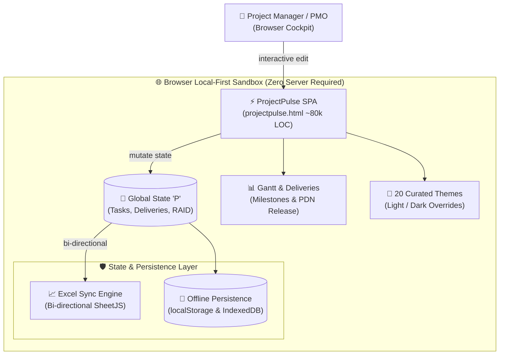
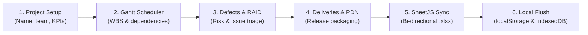
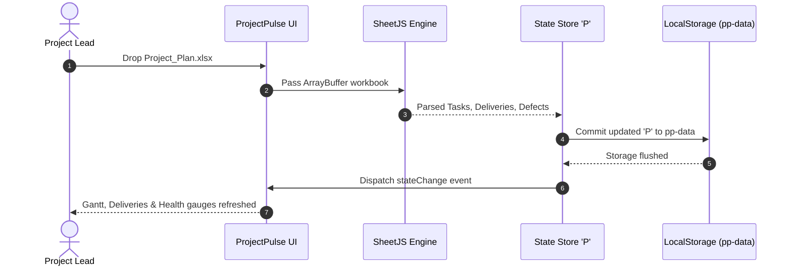
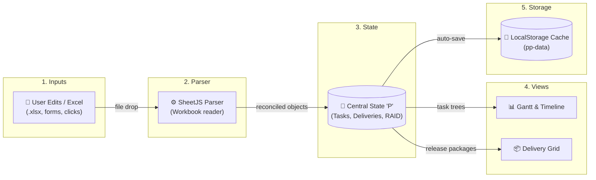
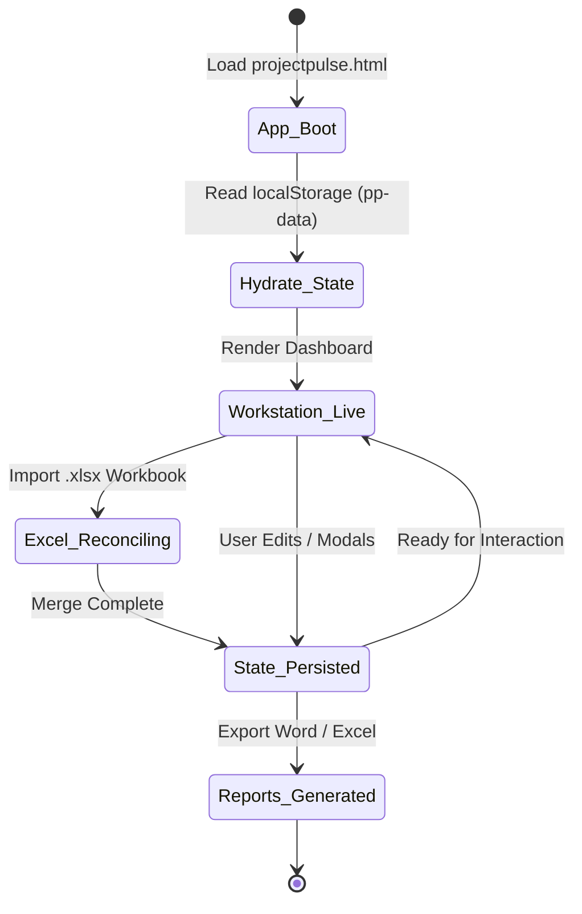

# ProjectPulse — Project Context & System Architecture

> **Monolithic Local-First Project Management Workstation**  
> High-density interactive PM workstation (~80,800 lines of Vanilla HTML5/JS/CSS) featuring 20 curated themes, bi-directional Excel synchronization, offline local storage persistence, Gantt scheduling, and software delivery tracking.

---

## 🏛️ System Architecture

Interactive Archify HTML: [`docs/diagrams/architecture.html`](./docs/diagrams/architecture.html)  
Specification: [`docs/diagrams/architecture.json`](./docs/diagrams/architecture.json)

---

## 🔄 Project Governance & Delivery Workflow

Interactive Archify HTML: [`docs/diagrams/workflow.html`](./docs/diagrams/workflow.html)  
Specification: [`docs/diagrams/workflow.json`](./docs/diagrams/workflow.json)

---

## ⚡ Bi-directional Excel Sync Sequence

Interactive Archify HTML: [`docs/diagrams/sequence.html`](./docs/diagrams/sequence.html)  
Specification: [`docs/diagrams/sequence.json`](./docs/diagrams/sequence.json)

---

## 🌊 Project Data Flow Pipeline

Interactive Archify HTML: [`docs/diagrams/dataflow.html`](./docs/diagrams/dataflow.html)  
Specification: [`docs/diagrams/dataflow.json`](./docs/diagrams/dataflow.json)

---

## ⏱️ Workstation Session Lifecycle

Interactive Archify HTML: [`docs/diagrams/lifecycle.html`](./docs/diagrams/lifecycle.html)  
Specification: [`docs/diagrams/lifecycle.json`](./docs/diagrams/lifecycle.json)

